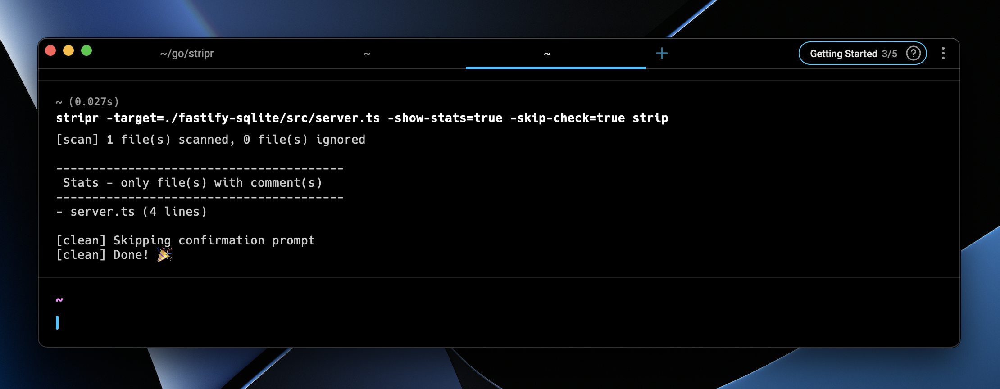

# Stripr CLI




Stripr can find and remove those nasty (debug) comments you left in your code, because why not?

### Current Limitations
- Only supports C-style comments
- Only supports flat directories (no subdirectories)

## Installation

### Using Homebrew


### Manual Installation

Stripr has been written in Golang which is a compiled language, so you will need to install the Golang compiler to build the binary or you can download the pre-built binaries from [this link](https://github.com/aosasona/stripr/assets/stripr-multiplatform.zip) (Linux, Windows, MacOS) and [extract them to your PATH](https://zwbetz.com/how-to-add-a-binary-to-your-path-on-macos-linux-windows/).

If you would like to build the binary yourself, you can do so by running the following command:

```bash
make build-release
```

OR

```bash
make build-auto
```

The `build-release` will build the binary for your current OS and architecture and place it in the `release` directory and `build-auto` will do the same but place it in the build directory with a sub-folder named after your OS and architecture. By default, the `build` folder is set to ignored by git for this project but you can build for **ALL** platforms locally by running the following command:

```bash
make build-all
```

You could tinker with the Makefile to build for other platforms, but I have not tested it outside Unix at the moment, let me know if you have any issues.


## Usage

```bash
stripr [options] [command]
```

Example:

```bash
stripr -target=./example -skip-check -show-stats strip
```

## Options

- `-target=string`
*The directory or file to read (default "." - current directory)*


- `-show-stats=true|false`
*Show the number of files and lines that will be affected*


- `-skip-check=true|false`
*Skip the confirmation prompt before stripping comments*

## Commands

- `init`		
*Create a config file in the current directory*


- `scan`	
*Scan the directory for comments*


- `strip` | `clean`		
*Remove comments from the directory (-skip-check to prevent asking for confirmation; use with caution)*
`help`
*Show the help message*

## Contributing
You can contribute to this project by opening an issue or a pull request, I will try to respond as soon as possible. This was a fun little project to work on to learn Golang and I hope you find it useful at some point.